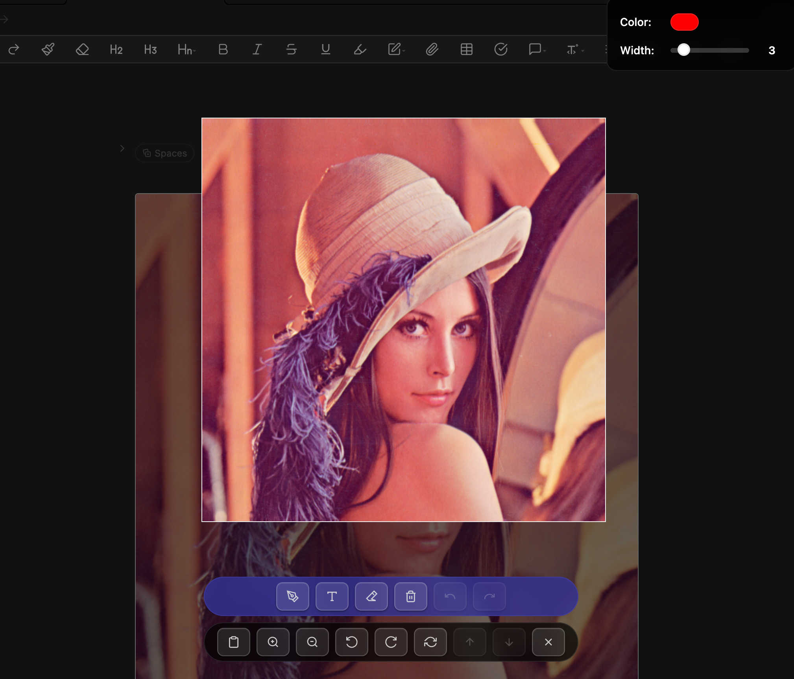
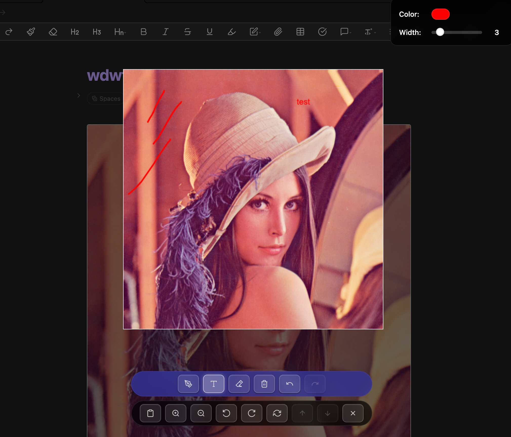

# 🖼️ Obsi-Lens

A powerful Obsidian plugin that transforms your image viewing experience with simple drawing tools, intelligent copying, and seamless navigation. Draw, annotate, rotate, and copy images with full preservation of your modifications.

## ✨ Features

### 🖼️ Enhanced Image Viewing
- **Fullscreen Image Display**: View images in a fullscreen overlay with transparent background
- **Zoom Controls**: Smooth zoom in/out with mouse wheel or keyboard shortcuts
- **Image Rotation**: Rotate images left or right with keyboard shortcuts
- **Drag & Pan**: Click and drag to move images around the viewport
- **Multi-Image Navigation**: Navigate between multiple images in the same document

### 🎨 Advanced Drawing Tools
- **Drawing Mode**: Draw freely on images with customizable colors and line width
- **Text Mode**: Add text annotations directly onto images with real-time preview
- **Eraser Mode**: Remove unwanted drawings or annotations with precision
- **Crop Tool**: Professional image cropping with resize handles and real-time preview
- **Clear All**: Quickly clear all drawings and annotations
- **Undo/Redo System**: Full undo/redo support with 50-step history for all operations
- **Drawing Settings Panel**: Real-time color picker and line width adjustment
- **Scale-Aware Drawing**: Drawing quality maintained at all zoom levels

### 💾 Smart Copy & Export
- **Enhanced Copy Function**: Automatically includes drawings and rotations when copying
- **High-Quality Rendering**: PNG export with optimal quality preservation
- **Original vs Modified**: Intelligently copies original image or modified version
- **Cross-Platform Clipboard**: Compatible with all major operating systems

### 🔧 Advanced Features
- **Popout Window Support**: Works seamlessly with Obsidian's popout windows
- **Multi-Image Navigation**: Browse through all images in the current document
- **Responsive Design**: Optimized for different screen sizes and orientations
- **Dark Theme Support**: Fully compatible with Obsidian's themes
- **Performance Optimized**: Smooth rendering with high-quality canvas operations

## 📸 Screenshots

### Basic Image Viewing

*Clean, fullscreen image viewing with intuitive controls*

### Drawing Tools in Action

*Drawing mode with color customization and text annotations*

### Professional Image Cropping

*Crop mode with resize handles and real-time preview overlay*


*Precise cropping with intelligent coordinate adjustment*

### Advanced Annotations

*Text annotations, zoom-in, and drawing tools working together*

## 🚀 Installation

### Manual Installation
1. Download the latest release files
2. Copy `main.js`, `manifest.json`, and `styles.css` to your vault's `.obsidian/plugins/obsi-lens/` directory
3. Enable the plugin in Obsidian's settings

### Development Installation
1. Clone this repository into your vault's `.obsidian/plugins/` directory
2. Run `npm install` to install dependencies
3. Run `npm run build` to build the plugin
4. Enable the plugin in Obsidian's settings

## ⌨️ Keyboard Shortcuts

### Image Navigation & View
| Shortcut | Action |
|----------|--------|
| `Escape` | Close image viewer |
| `+` / `=` | Zoom in |
| `-` / `_` | Zoom out |
| `←` | Rotate left |
| `→` | Rotate right |
| `↑` | Previous image |
| `↓` | Next image |
| `R` | Reset view |

### Drawing & Annotation
| Shortcut | Action |
|----------|--------|
| `W` | Toggle drawing mode |
| `T` | Toggle text mode |
| `C` | Toggle crop mode |
| `Enter` | Apply crop (when in crop mode) |
| `Ctrl+Shift+Z` / `Cmd+Shift+Z` | Redo last action |

### Copy & Export
| Shortcut | Action |
|----------|--------|
| `Cmd+C` / `Ctrl+C` | Copy image (includes drawings & rotation) |

## ⚙️ Configuration

Customize the plugin behavior with these settings:

| Setting | Description | Default |
|---------|-------------|---------|
| **Show Copy Button** | Toggle copy button in toolbar | `true` |
| **Enable Keyboard Shortcuts** | Enable/disable all shortcuts | `true` |
| **Zoom Increment** | Step size for zoom operations | `0.2` |
| **Drawing Color** | Default drawing color | `#ff0000` |
| **Line Width** | Default drawing line width | `3` |

## 🎯 Pro Tips

- **Quick Access**: Right-click any image → "Enhanced Image Viewer"
- **Multi-Image Browsing**: Use ↑/↓ arrows to navigate between document images
- **Perfect Copies**: Drawings and rotations are automatically included when copying
- **Professional Cropping**: Use 'C' to activate crop mode with resize handles and live preview
- **Precise Crop Control**: Drag handles to resize, drag inside to move, Enter to apply
- **Undo Everything**: Ctrl+Z works for all operations including cropping
- **Text Rotation**: Text added on rotated images stays readable
- **Scale Independence**: Drawing quality is preserved at all zoom levels

## 🛠️ Development

### Prerequisites
- Node.js (v16 or higher)
- npm or yarn

### Building
```bash
# Install dependencies
npm install

# Development build with watch mode
npm run dev

# Production build
npm run build
```

### Project Structure
```
├── main.ts           # Main plugin logic and image viewer implementation
├── main.js           # Compiled JavaScript (generated)
├── manifest.json     # Plugin manifest
├── styles.css        # Plugin styles and UI components
├── package.json      # Node.js dependencies and scripts
├── tsconfig.json     # TypeScript configuration
└── esbuild.config.mjs # Build configuration
```

## 🤝 Contributing

Contributions are welcome! Please feel free to submit a Pull Request.

## 📄 License

This project is licensed under the MIT License - see the [LICENSE](LICENSE) file for details.

## 👨‍💻 Author

**YT Han**

---

## 🌟 What Makes It Special?

- **🎨 Simple Drawing Tools**: Full-featured drawing system with undo/redo
- **✂️ Professional Cropping**: Handle-based cropping with real-time preview and smart cursors
- **🔄 Smart Copy Function**: Automatically preserves drawings and rotations  
- **📱 Multi-Image Navigation**: Seamlessly browse document images
- **⚡ High Performance**: Optimized canvas rendering for smooth interactions
- **🎯 Intelligent Features**: Scale-aware drawing, real-time previews, and more

*Obsi-Lens transforms Obsidian into a powerful image editing platform with professional cropping, drawing tools, and intelligent automation.*